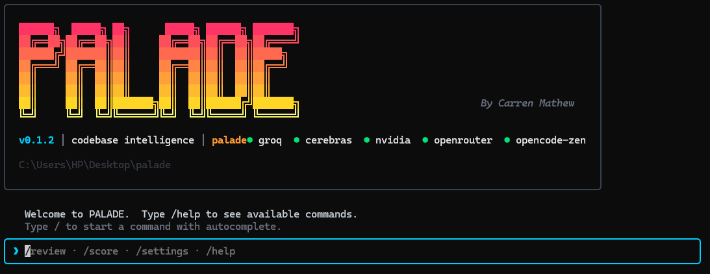

# Palade



**An AI-powered codebase intelligence engine that reviews code with a swarm of specialized agents, not just a single bot.**

## Installation

You can install Palade globally using npm to run it from anywhere on your machine:

```bash
npm install -g palade
```

## What is Palade?

Palade is a sophisticated CLI and TUI (Terminal User Interface) tool that runs a swarm of AI agents over your codebase. Instead of sending your entire codebase to a single LLM, Palade uses a specialized architecture:
1. **Triage:** It figures out which files are most important.
2. **Specialist Agents:** It runs multiple specialized agents (Security, Architecture, Performance, Maintainability, Dead Code, and Test Intelligence) concurrently over the codebase.
3. **Synthesis:** A synthesis agent reviews the cross-cutting findings and produces a prioritized, actionable report.

Palade is optimized for **TypeScript and JavaScript** projects but also works with other languages. It runs entirely on your local machine and communicates directly with your LLM provider of choice (Groq, Cerebras, OpenRouter, Nvidia, or locally via Ollama).

## Commands

### Interactive TUI

Simply run `palade` in your terminal to launch the interactive TUI. 
```bash
palade
```
From here you can run commands like `/review`, `/score`, `/diff`, and configure your LLM providers using `/settings`.

### CLI Commands

You can also run commands directly from your terminal without opening the interactive UI:

#### `palade review`
Run a full swarm review over your project.
```bash
palade review
```
- Use `--target <name>` to review specific targets.
- Use `--file <path>` to review specific files.
- The output includes an interactive HTML report and a Markdown summary.

#### `palade watch`
Run the review daemon in the background. It watches your files for changes, debounces them, and automatically runs a review.
```bash
palade watch
```
*Note: This command runs continuously and should be run in a separate terminal window.*

#### `palade score`
Check your codebase health score and view your score history.
```bash
palade score
```

#### `palade diff`
Review only the files that have changed since your main branch or last commit.
```bash
palade diff --base main
```

#### `palade targets`
Manage specific sub-areas of your project (targets) to review independently.
```bash
palade targets list
palade targets add <name>
palade targets search <query>
```

## Getting Started

Initialize your project to create a `palade.config.ts` configuration file:
```bash
palade init
This lets you set your API keys, LLM providers, and customize the swarm's behavior!

### Configuration: Economy Mode

By default, Palade runs in **Economy Mode** (`economyMode: true`), meaning all specialist lenses (Security, Architecture, Performance, etc.) are evaluated in a single API call per chunk. This drastically reduces token spend and latency. 

If you want maximum prompt richness per domain and don't mind the increased API cost, you can disable economy mode in your `palade.config.ts`:
```typescript
export default {
  swarm: {
    economyMode: false,
  }
}
```
